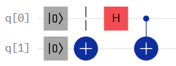

## Properties of Circuits

*Depth*      
: Imagining each gate as taking up one time slice, but gates that could be executed together taking up a single time slice, the depth is
the number of time slices in the circuit.

*Space*       
: the total number of qubits (or wires) in the circuit.

*Total Gates*       
: the total number of gates used in the circuit.

For each of the following circuits...       
a. Find the state of the computer at the end of the circuit.       
b. Find the depth, space, and total gates.      

> - Use $|\psi\rangle$ (psi/"sigh") for each step in the circuit

1. 

> - Walk through example 1 step-by-step
---
2. 
---
3. 
